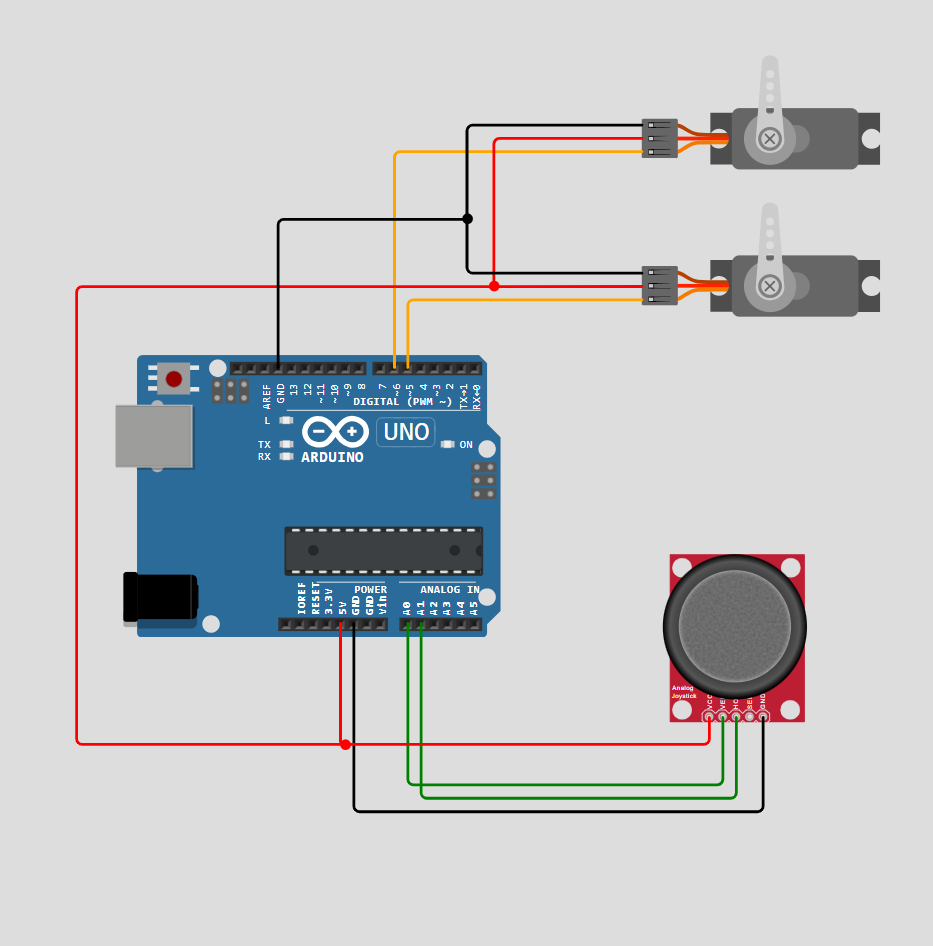

# Simple Airplane Project

tujuan dari project ini adalah menciptakan pesawat mainan yang bisa dikendalikan melalui remot kontrol. Nantinya dapat dikembangkan lagi menjadi hal yang lebih spektakuler misalnya warfare drone.

## Diagram

> [!NOTE]
>Rangkaian diatas baru membuat flaps kanan dan kiri, belum termasuk elevator dan rangkaian receiver dari remot kontrol.

## Catatan 

Kedepannya repository ini akan terus diupdate dengan segala progressnya, hal ini karena membangun sebuah hardware membutuhkan waktu dan biaya. Sehingga sabar adalah kunci.

> [!CAUTION]
> Code pada project ini sudah dicoba dicompile dan aman, namun belum dites di hardware secara langsung dikarenakan keterbatasan sumber daya. Error ataupun kesalahan bisa saja terjadi.

